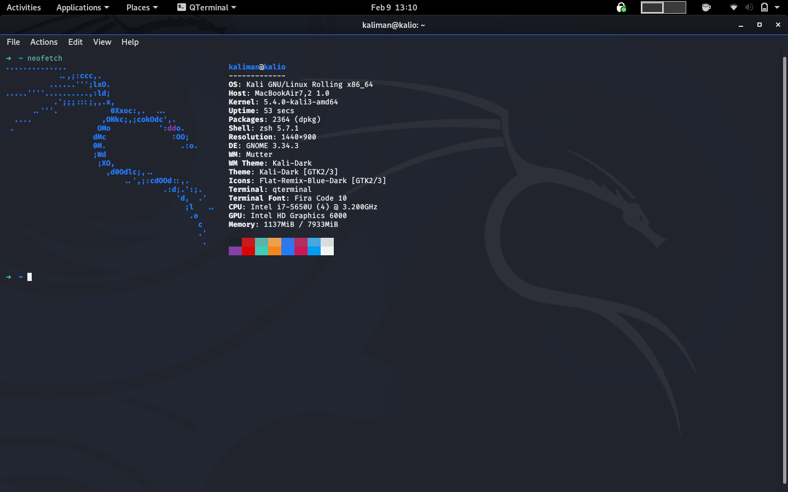

# KaliBook 

Some notes on setting up [Kali Linux](https://www.kali.org/) on an old [Macbook Air 2015](https://everymac.com/systems/apple/macbook-air/specs/macbook-air-core-i7-2.2-13-early-2015-specs.html).

## Key Points

* Apple makes some of the nicest laptops available but couples them with an OS that is very hard to customize. It would be nice if we could have a MacBook running macOS along with a Linux distro. With newer laptops that have the T1/T2 security chip, it becomes almost impossible to efficiently run Linux. The battery performance is sub-par and there can be infrequent crashes every now and then.

* [**Overview of the current state of support for Linux on mac.**](https://github.com/Dunedan/mbp-2016-linux)

* With recent kernel upgrades, the MacBooks without the touchbar now have complete support in the linux kernel. This makes the [MacBook Air 7,2](https://igotoffer.com/apple/macbook-air-7-2) a unique machine. It's old enough that it is now well supported.
* Recently something really big happened in the world of penetration testing. KaliOS has apparently decided to go a bit more mainstream. [They have also introduced a new theme based on Gnome, and most imprtantly the default user is no longer root.](https://www.kali.org/news/kali-default-non-root-user/)
* Another interesting thing of note is that the default kernel has no out of the box support for wifi which requires the [broadcom driver](https://packages.debian.org/jessie/all/broadcom-sta-common/download), so it's best if the MacBook can be connected to the internet via USB tethering or USB to Ehernet before installation begins.

## Cheatsheet

### [Excellent page with lots of information on the whole preocedure.](https://www.kali.org/docs/base-images/kali-linux-dual-boot-kali-on-mac-hardware/)
#### Important information

* Use cmd+R to boot into recovery. Choose utilities and use following commands to change System Integrity Protection or SIP.
 
		csrutil disable //to disable SIP
		csrutil enable  //to enable SIP again
		csrutil status  //to check SIP status
 
* Hold **alt/option** key on startup for boot menu.
* [Add default kali repos](https://www.kali.org/docs/general-use/kali-linux-sources-list-repositories/).

		sudo nano /etc/apt/sources.list
		deb http://http.kali.org/kali kali-rolling main non-free contrib
* [Initializing Xorg display server manually.](https://faq.i3wm.org/question/6126/how-do-i-start-i3/index.html)
		
		sudo nano ~/.xinitrc
		exec i3 // or exec gdm
		startx
	
	
* [Switching desktop environment](https://gist.github.com/jayluxferro/5cb6ee45726bd30264918df2b0553b70).  
For Gnome

 		sudo apt-get install gnome-core kali-defaults kali-root-login desktop-base

* [Configure network from command line](https://developer.gnome.org/NetworkManager/unstable/nmcli-examples.html)

		nmcli connection

* [Adding wifi broadcom drivers](https://wiki.debian.org/wl)

		sudo apt-get update
		sudo apt-get install linux-image-$(uname -r|sed 's,[^-]*-[^-]*-,,') linux-headers-$(uname -r|sed 's,[^-]*-[^-]*-,,') broadcom-sta-dkms
		sudo modprobe -r b44 b43 b43legacy ssb brcmsmac bcma
		sudo modprobe wl

* **System information**

		neofetch

